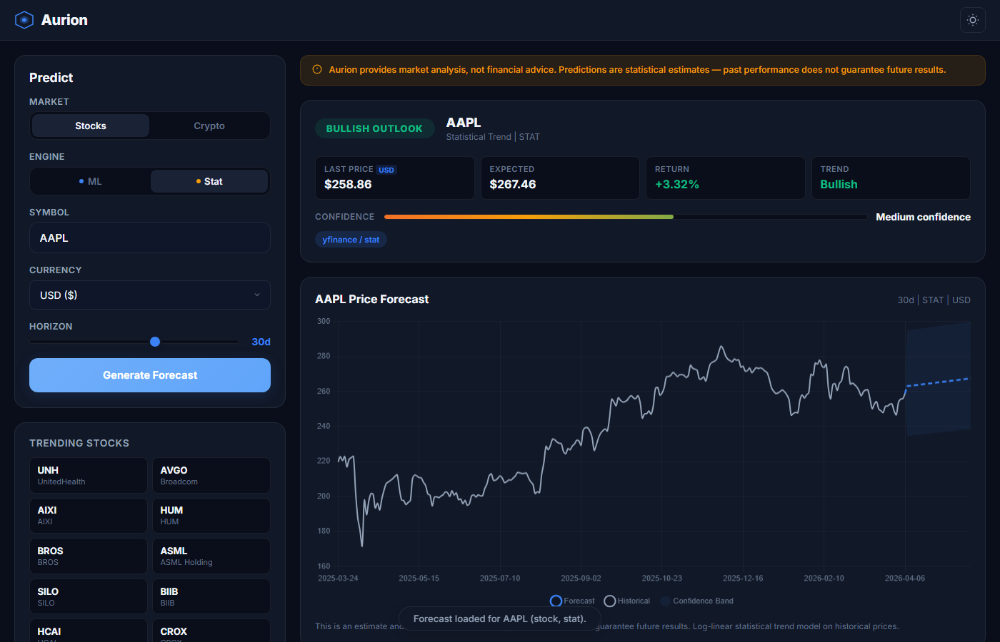
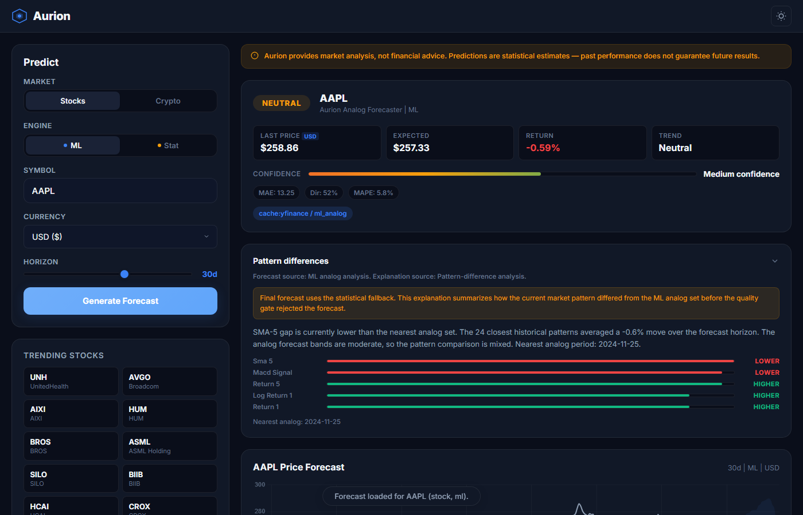
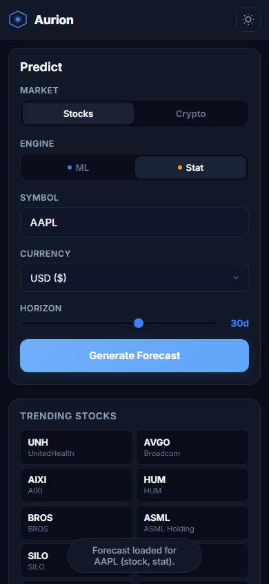
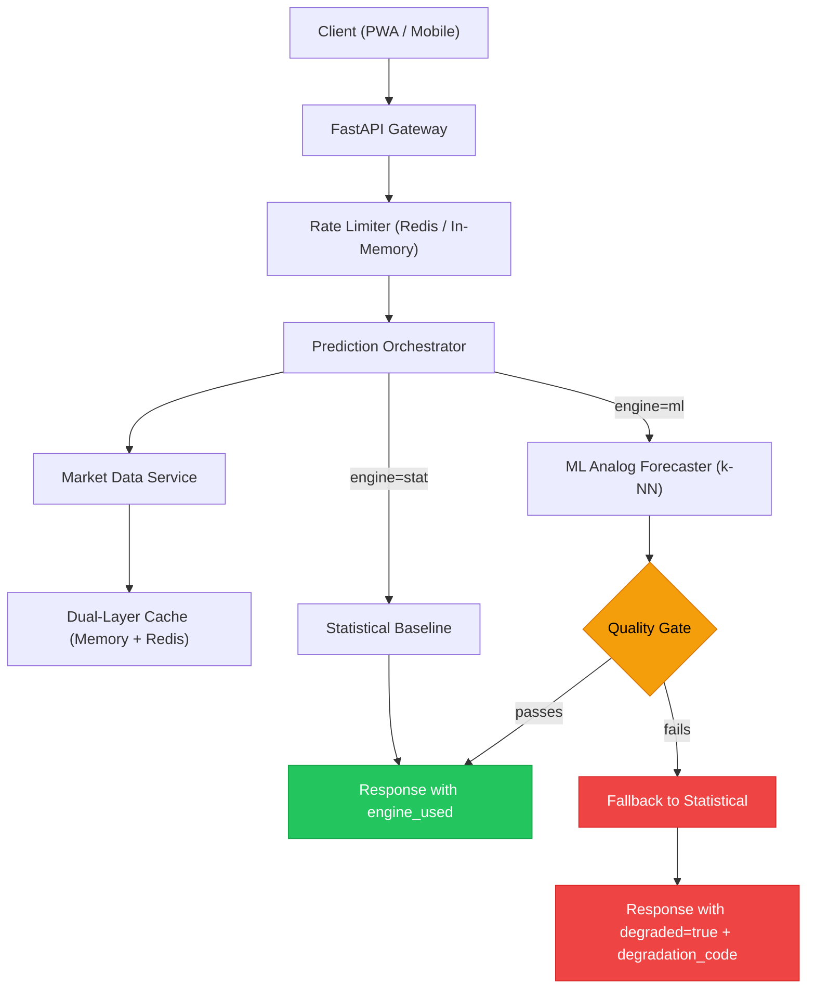

# Aurion

> Market forecasting that tells you when it doesn't know.

[](https://github.com/Davidvdv231/Aurion/actions/workflows/ci.yml)


Aurion is a multi-engine market forecasting system that combines statistical baselines and ML pattern matching with explicit quality gating and transparent degradation. When a model underperforms its benchmark, the system falls back honestly and tells you why. Built for trust under imperfect conditions, not prediction theater.

### Why this matters

Most forecasting tools either silently serve bad predictions or fail without explanation. Aurion takes a different approach: every prediction passes through a quality gate that checks directional accuracy, error margins, and validation depth. If the ML model can't beat a simple statistical baseline, the system says so explicitly — with a degradation code, a human-readable reason, and a fallback forecast. This makes the output trustworthy by default, not by assumption.

### Highlights

- **Multi-engine forecasting** — statistical baseline and k-NN analog pattern matching, with automatic engine selection
- **Quality gating with transparent fallback** — ML predictions are validated against baselines; failures degrade honestly with specific codes
- **Currency conversion** — server-side forex via yfinance, supporting 7 currencies with 1-hour cache
- **Observability** — structured JSON logging, Prometheus metrics, request tracing, and health/readiness probes

## Screenshots

**Statistical forecast with chart and signal card:**



**ML prediction with quality gate fallback and pattern explanation:**



**Responsive mobile layout:**



## Architecture



## Design Decisions

| Decision | Choice | Trade-off |
|----------|--------|-----------|
| Forecasting approach | Multi-engine with quality gating | More complex orchestration, but honest about prediction quality |
| ML model | k-NN analog pattern matching | Simple and interpretable, but limited expressiveness vs. deep learning |
| Frontend framework | Vanilla JS PWA | Zero build step, instant deployment, but no component reuse |
| Rate limiting | Redis-backed with Lua atomic ops | Fail-closed in production protects infra, but Redis failure = 503 |
| Caching | Dual-layer (memory + Redis) | Fast reads with persistence, but cache invalidation complexity |
| Currency conversion | Server-side via yfinance forex pairs | Real-time rates with 1-hour cache, supports USD/EUR/GBP/JPY/CHF/CAD/AUD |
| Request tracing | Request-ID middleware with sanitization | Every request gets a traceable ID in logs and response headers |

## Prediction Engine & Degradation

| Condition | Engine Used | Degraded | Code |
|-----------|------------|----------|------|
| Stat engine requested | `stat` | `false` | — |
| ML requested, quality passes | `ml` | `false` | — |
| ML requested, validation windows < 3 | `stat_fallback` | `true` | `model_validation_insufficient` |
| ML requested, directional accuracy < 0.45 | `stat_fallback` | `true` | `model_quality_insufficient` |
| ML requested, MAPE > baseline MAPE | `stat_fallback` | `true` | `model_baseline_underperforming` |
| ML requested, training timeout (>15s) | `stat_fallback` | `true` | `ml_engine_timeout` |
| ML requested, exception during training | `stat_fallback` | `true` | `ml_engine_unavailable` |

## Example API Responses

**Clean ML prediction:**

```json
{
  "symbol": "AAPL",
  "asset_type": "stock",
  "currency": "USD",
  "native_currency": "USD",
  "display_currency": "USD",
  "engine_requested": "ml",
  "engine_used": "ml",
  "model_name": "Aurion Analog Forecaster",
  "degraded": false,
  "degradation_code": null,
  "degradation_message": null,
  "summary": {
    "expected_price": 198.45,
    "expected_return_pct": 2.3,
    "trend": "bullish",
    "confidence_tier": "medium",
    "signal": "Bullish Outlook"
  },
  "evaluation": {
    "mae": 3.21,
    "rmse": 4.15,
    "mape": 1.8,
    "directional_accuracy": 0.62,
    "validation_windows": 5
  },
  "forecast": [
    {"date": "2026-04-07", "predicted": 194.82, "lower": 191.20, "upper": 198.44}
  ]
}
```

**Degraded ML to stat fallback:**

```json
{
  "symbol": "GME",
  "asset_type": "stock",
  "engine_requested": "ml",
  "engine_used": "stat_fallback",
  "degraded": true,
  "degradation_code": "model_quality_insufficient",
  "degradation_message": "ML directional accuracy (0.38) below threshold (0.45); using statistical fallback.",
  "summary": {
    "expected_price": 27.15,
    "expected_return_pct": -1.2,
    "trend": "bearish",
    "confidence_tier": "low",
    "signal": "Bearish Outlook"
  },
  "evaluation": null,
  "forecast": [
    {"date": "2026-04-07", "predicted": 27.42, "lower": 25.80, "upper": 29.04}
  ]
}
```

**Clean statistical baseline:**

```json
{
  "symbol": "BTC-USD",
  "asset_type": "crypto",
  "engine_requested": "stat",
  "engine_used": "stat",
  "degraded": false,
  "degradation_code": null,
  "summary": {
    "expected_price": 84250.00,
    "expected_return_pct": 1.8,
    "trend": "bullish",
    "confidence_tier": "medium",
    "signal": "Bullish Outlook"
  },
  "evaluation": null
}
```

## API Reference

| Endpoint | Method | Purpose |
|----------|--------|---------|
| `/api/health` | GET | Liveness check — status, Redis health, cache size, uptime |
| `/api/health/ready` | GET | Readiness check — returns 503 when dependencies are down |
| `/api/metrics` | GET | Prediction metrics snapshot (protected by `METRICS_TOKEN` when set) |
| `/api/tickers` | GET | Search tickers by query (1-50 results) |
| `/api/top-assets` | GET | Trending assets by type, cached 15 min |
| `/api/metrics/prometheus` | GET | Prometheus exposition format (protected by `METRICS_TOKEN` when set) |
| `/api/validation-summary` | GET | ML quality-gate thresholds and latest evaluation (protected) |
| `/api/predict` | POST | Multi-engine prediction with quality gating and degradation |

## Quick Start

```bash
# Clone and start
git clone https://github.com/Davidvdv231/Aurion.git
cd Aurion

# Run with Docker (includes Redis)
docker-compose -f infra/docker-compose.yml up --build

# Verify
curl http://localhost:8000/api/health

# Get a prediction (prices in USD)
curl -X POST http://localhost:8000/api/predict \
  -H "Content-Type: application/json" \
  -d '{"symbol": "AAPL", "asset_type": "stock", "engine": "stat", "horizon": 30}'

# Get a prediction with currency conversion
curl -X POST http://localhost:8000/api/predict \
  -H "Content-Type: application/json" \
  -d '{"symbol": "AAPL", "asset_type": "stock", "engine": "ml", "horizon": 30, "display_currency": "EUR"}'
```

For local development without Docker:

```bash
cd backend
pip install -r requirements.txt
uvicorn app:create_app --factory --reload
```

## Testing

```bash
# Run all tests
pytest tests/ -v

# Run with coverage
pytest tests/ --cov=backend --cov-report=term-missing

# Type checking
mypy backend/ --strict

# Linting
ruff check backend/ tests/
```

78 tests covering: API contracts, prediction orchestration, ML pipeline, rate limiting, market data integrity, exchange rates, configuration, smoke integration, and frontend E2E (Playwright).

## Tech Stack

| Layer | Technology | Purpose |
|-------|-----------|---------|
| API | FastAPI 0.115 / Python 3.12 | Async API with validation |
| ML | scikit-learn / NumPy / pandas | k-NN analog pattern forecaster |
| Cache | Redis 7 + in-memory TTL | Dual-layer with configurable TTLs |
| Web | Vanilla JS PWA | Zero-dependency frontend with service worker |
| Mobile | React Native / Expo 54 | Cross-platform mobile client |
| Market Data | yfinance | OHLCV data ingestion |
| CI/CD | GitHub Actions | Lint, type check, test, audit |
| Deploy | Docker + Docker Compose | Containerized with health checks |

## Known Limitations

- **ML model is k-NN analog** — simple by design, not a deep learning system. Effective for pattern matching, limited for complex market dynamics.
- **Market data via yfinance** — free and functional, but not a production-grade feed. Rate limits and data gaps may occur.
- **No persistent storage** — models and cache reset on container restart. No user database.
- **No user authentication** — stateless API, no multi-tenancy or user sessions. Operational endpoints (`/api/metrics`, `/api/validation-summary`) can be protected via the `METRICS_TOKEN` env var.
- **Mobile chart is a visual placeholder** — forecast cards work, but no charting library integrated yet.
- **Single-process deployment** — no horizontal scaling or distributed training.

## Engineering Trade-offs

- **Vanilla JS PWA over React/Vue** — zero build step means instant deployment and no framework churn, at the cost of no component reuse or state management.
- **k-NN analog over deep learning** — interpretable, fast to train on-demand, and honest about its limitations. Deep learning would need a training pipeline, GPU infra, and would be harder to explain.
- **In-memory metrics with Prometheus export** — lightweight counters with a `/api/metrics/prometheus` endpoint for external scraping. No full Prometheus client dependency.
- **Statistical fallback always available** — guarantees every request gets a response, but the stat forecast is basic (log-linear regression + volatility bands).
- **Fail-closed rate limiting in production** — one Redis failure means 503 for everyone, but prevents abuse. Development mode is fail-open.
- **Thread pool for blocking tasks** — avoids blocking the async event loop, but adds concurrency limits (8 workers default).

## Project Status

Aurion is a solo-built MVP. The prediction orchestration, degradation semantics, currency conversion, and web PWA are production-minded — designed with real deployment patterns (rate limiting, health probes, structured logging, security headers) but scoped as a portfolio-grade MVP, not a scaled production system. The ML model is functional but would benefit from deeper validation on more volatile assets. The mobile app (React Native/Expo) covers core functionality — predictions, watchlist, currency selection, degradation badges — but does not have full feature parity with the web client: charting is placeholder-only, autocomplete uses local fallback data, and there is no offline-first sync.

**Current focus:** Pre-launch hardening complete — XSS mitigation, endpoint protection, mobile error boundaries, automated cache versioning, and expanded test coverage (78 tests).

## License

MIT
